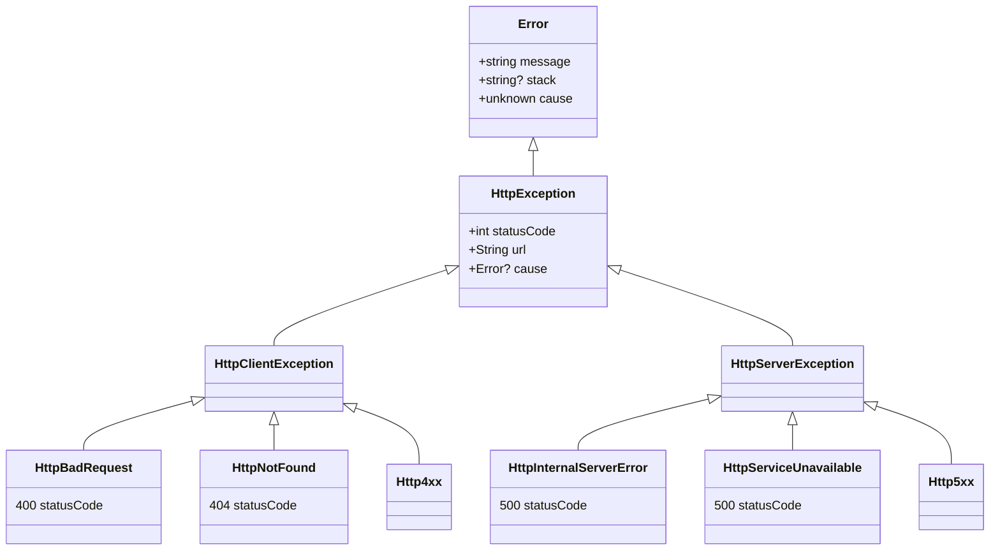

import {Tabs, Tab, Callout} from 'nextra/components';

Plain HTTP exceptions for Node.js, Deno, Edge, and browsers. Zero dependencies, TypeScript-ready.
Includes an optional serializer for hybrid contexts (àlà nextjs) and/or logging purposes.


[](https://www.npmjs.com/package/@httpx/exception)
[](https://bundlephobia.com/package/@httpx/exception@latest)
[](https://github.com/belgattitude/httpx/blob/main/packages/exception/.size-limit.cjs)
[](https://browserslist.dev/?q=PiAwLjAxJSwgbm90IGRlYWQ%3D)
[](https://browserslist.dev/?q=PjAuMjUlLCBub3QgZGVhZA%3D%3D)
[](https://codecov.io/gh/belgattitude/httpx)
[](https://codeclimate.com/github/belgattitude/httpx)
[](https://codeclimate.com/github/belgattitude/httpx)
[](https://github.com/belgattitude/httpx/blob/main/LICENSE)

## Highlights

- 🚀&nbsp; Simple use: [explicit named imports](https://belgattitude.github.io/httpx/#/?id=named-exceptions) and/or [status code](https://belgattitude.github.io/httpx/#/?id=factories).
- ✨‍&nbsp; Default statusText as [error message](https://belgattitude.github.io/httpx/#/?id=about-default-message). Less to type, reduce divergence...
- 🎥&nbsp; Optionally attach some common [contextual](https://belgattitude.github.io/httpx/#/?id=about-context) info (less guessing, loggers...).
- 🐎&nbsp; Built-in [serializer](https://belgattitude.github.io/httpx/#/?id=serializer) to cover Server-Side-Rendering use-cases (nextjs, superjson,...).
- 🎯&nbsp; [Extends](https://belgattitude.github.io/httpx/#/?id=uml-class-diagram) Error class with [stack](https://developer.mozilla.org/en-US/docs/Web/JavaScript/Reference/Global_Objects/Error/stack) trace and [Error.cause](https://belgattitude.github.io/httpx/#/?id=about-errorcause) support.
- 📡&nbsp; Framework agnostic, no deps. Works everywhere: node, browsers, edge...
- 🍃&nbsp; [Lightweight](https://bundlephobia.com/package/@httpx/exception@latest) - [treeshakable](https://github.com/belgattitude/httpx/blob/main/packages/exception/.size-limit.cjs) - wide [browser coverage](https://browserslist.dev/?q=PiAwLjAxJSwgbm90IGRlYWQ%3D) (trade-off).
- 🧙‍&nbsp; IDE friendly. Typescript - typedoc with links to mdn and description.
- 🥃&nbsp; [Docs](https://belgattitude.github.io/httpx) & [changelogs](https://github.com/belgattitude/httpx/releases) - Well tested and maintained - [Contributors](https://github.com/belgattitude/httpx/blob/main/CONTRIBUTING.md) welcome.


## Usage

### Named exceptions

IETF assigned http error status codes are available under individual named exports. They start by the
by `Http` prefix to ease ide experience (suggestions) and to avoid naming collisions
(ie: domain exceptions such as NotFound...). You'll find the current supported list in [this section](#list-of-named-exceptions).

```typescript
import { HttpNotFound, HttpServiceUnavailable } from '@httpx/exception/dist';
```

#### HttpException parameters

Http exception optionally accepts a parameter of type `string | HttpExceptionParams`. If no parameter
is provided a [default message](#about-default-message) will be set.
When a `string` is provided it will be used as the error message, otherwise you can use the following params:

| HttpExceptionParams | Type      | Description                                                                                                                                                           |
| ------------------- | --------- | --------------------------------------------------------------------------------------------------------------------------------------------------------------------- |
| message             | `string?` | [Error.message](https://developer.mozilla.org/en-US/docs/Web/JavaScript/Reference/Global_Objects/Error/message), see [about default message](#about-default-message). |
| url                 | `string?` | Origin url ([about context](#about-context)).                                                                                                                         |
| method              | `string?` | Origin http method ([about context](#about-context)).                                                                                                                 |
| code                | `string?` | Custom code ([about context](#about-context)).                                                                                                                        |
| errorId             | `string?` | Unique id ([about context](#about-context)).                                                                                                                          |
| cause               | `Error?`  | Error.cause, see also [about error cause](#about-errorcause).                                                                                                         |

Example:

```typescript
import {
  HttpGatewayTimeout,
  HttpInternalServerError,
  HttpNotFound,
} from '@httpx/exception';

// Simple
throw new HttpNotFound(); // message = 'Not found'

// Custom message
throw new HttpNotFound('User not found');

// Another way
const fetchData = async <T,>(url: string): Promise<T | Error> => {
  return new HttpInternalServerError({
    url,
    cause: new HttpGatewayTimeout({
      code: 'This Serverless Function has timed out',
      errorId: 'cdg1::h99k2-1664884491087-b41a2832f559',
    }),
  });
};
```

#### HttpException properties

| HttpException | Type                | Description                                                                                                                        |
| ------------- | ------------------- | ---------------------------------------------------------------------------------------------------------------------------------- |
| statusCode    | `number`            | Http error status code (400-599).                                                                                                  |
| message       | `string`            | Default or provided message.                                                                                                       |
| url           | `string?`           | Origin url ([about context](#about-context)).                                                                                      |
| method        | `string?`           | Origin http method ([about context](#about-context)).                                                                              |
| code          | `string?`           | Custom code ([about context](#about-context)).                                                                                     |
| errorId       | `string?`           | Unique id ([about context](#about-context)).                                                                                       |
| stack         | `string?`           | @see [Error.prototype.stack](https://developer.mozilla.org/en-US/docs/Web/JavaScript/Reference/Global_Objects/Error/Stack) on MDN. |
| cause         | `Error?`            | @see [about error cause](#about-errorcause)                                                                                        |
| errors?       | `ValidationError[]` | Only supported by HttpUnprocessableEntity (422)                                                                                    |

### Factories

#### createHttpException

The `createHttpException` function allows to create an exception from an
arbitrary status code.

```typescript
import { createHttpException } from '@httpx/exception';

const e404 = createHttpException(404); // e404 instanceof HttpClientException
const e500 = createHttpException(500); // e500 instanceof HttpServerException
```

Additional [parameters](#httpexception-parameters) can be provided as a second argument.

```typescript
throw createHttpException(404, 'The graal is yet to find !');

throw createHttpException(500, {
  message: 'Something really wrong happened.',
  url: 'https://api.dev/gateway',
  cause: new HttpNotImplemented(), // or any Error...
});
```

> **Warning**
> No checks are done about the validity of the provided status code. See also
> [about non-official status codes](#non-official-status-codes)

### Types and validation

#### Typeguards

```typescript
import {
  isHttpException,
  isHttpClientException,
  isHttpServerException,
  isHttpErrorStatusCode,
} from '@httpx/exception';

// True
isHttpErrorStatusCode(404);
isHttpException(new HttpNotFound());
isHttpClientException(new HttpNotFound());
isHttpServerException(new HttpInternalServerError());

// False
isHttpErrorStatusCode(200);
isHttpClientException(new HttpInternalServerError());
isHttpServerException(new HttpNotFound());
isHttpException(new Error());
```

#### Instance checks

> **Note**
> take a look at the [uml class diagram](#uml-class-diagram).

```typescript
// True
new HttpNotFound() instanceof HttpNotFound;
new HttpNotFound() instanceof HttpException;
new HttpNotFound() instanceof HttpClientException;
new HttpInternalServerError() instanceof HttpServerException;

// False
new HttpNotFoundError() instanceof HttpServerException;
new HttpInternalServerError() instanceof HttpClientException;
new Error() instanceof HttpException;
```

## Serializer

Exceptions can be (de-)serialized to json or other formats. Use cases varies from
ssr-frameworks (ie: nextjs [getServerSideProps](https://nextjs.org/docs/basic-features/data-fetching/get-server-side-props))
/ loggers (sentry, winston...).

Nested error causes are supported but ignored [if not supported](#about-errorcause) by
the runtime.

Additionally, you can pass any native errors (`Error`, `EvalError`, `RangeError`, `ReferenceError`,
`SyntaxError`, `TypeError`, `URIError`) as well as a custom one (the later will be transformed to the base type Error).

### JSON

```typescript
import { fromJson, toJson } from '@httpx/exception/serializer';

const e = new HttpForbidden();

const json = toJson(e); // string
const deserialized = fromJson(json);

// e === deserialized
```

> **Note**
> See also how to integrate with [superjson](https://github.com/blitz-js/superjson#recipes)

### Serializable

Same as JSON but before json.parse/stringify. Allows to use a different encoder.

```typescript
import {
  convertToSerializable,
  createFromSerializable,
} from '@httpx/exception/serializer';

const e = new HttpForbidden({
  cause: new Error('Token was revoked'),
});

const serializableObject = convertToSerializable(e);
const deserialized = createFromSerializable(serializableObject);
// e === deserialized
```

## Notes

### About default message

The `message` parameter can be omitted for [known exceptions](#list-of-named-exceptions). It will be set by default
to an english status text (inferred from the exception name).

```typescript
import { createHttpException, HttpMethodNotAllowed } from '@httpx/exception';

const e1 = new HttpMethodNotAllowed();
const e2 = new HttpMethodNotAllowed('Method not allowed');
const e3 = new HttpMethodNotAllowed({
  message: 'Method not allowed',
});
const e4 = createHttpException(HttpMethodNotAllowed.STATUS, {
  message: 'Method not allowed',
});
// e1.message === e2.message === e3.message === e4.message
```

### About context

It's possible to attach a context to the exception (for logging, reporting...). This can be done by passing the following parameters to [HttpExceptionParams](#httpexception-parameters).

| Name    | Type      | Description                                                    |
| ------- | --------- | -------------------------------------------------------------- |
| url     | `string?` | url on which the error happened                                |
| method  | `string?` | http method used to load the url                               |
| code    | `string?` | Custom code (ie: 'NETWORK_FAILURE', 'AbortError', 'E-1234'...) |
| errorId | `string?` | Unique error identifier (ie: uuid, nanoid...)                  |

```typescript
const err = new HttpRequestTimeout({
  url: 'https://api.dev/user/belgattitude',
  method: 'GET',
  code: 'NETWORK_FAILURE',
  errorId: nanoid(),
});
console.log(err.url, err.method, err.code, err.errorId);
```

> **Note**
> As contextual info might cause security concern they should be explicitly added. Please contribute or open an issue.

### About Error.cause

Http exceptions and the [serializer](#serializer) support the recent [Error.prototype.cause](https://developer.mozilla.org/en-US/docs/Web/JavaScript/Reference/Global_Objects/Error/cause#browser_compatibility). When not
available in the runtime (browser, node, deno, edge...) the library simply discard the parameter (no runtime error).

```typescript
const err = new HttpNotFound({ cause: new Error() });
console.log(err.cause); // undefined if not supported by runtime
```

> **Warning**
> Error.prototype.cause is supported on node >= 16.9.0 and. Caniuse.com indicates a support for
> [>90% of browsers](https://caniuse.com/mdn-javascript_builtins_error_error_options_cause_parameter).
> as of September 2022. There's few polyfills that can be used if needed ([error-cause-polyfill](https://github.com/ehmicky/error-cause-polyfill),
> [error-cause](https://github.com/es-shims/error-cause)...)

## Examples

Examples are given "as is" and does not represent a real-world usage.

### Backend

```typescript
import type { IncomingMessage, ServerResponse } from 'node:http';
import { toJson } from '@httpx/exception/serializer';
import {
  HttpForbidden,
  HttpImATeapot,
  HttpInternalServerError,
  HttpNotFound,
  HttpUpgradeRequired,
  isHttpServerException,
} from '@httpx/exception';

// Imaginary logger
const ignoredCodes = [HttpNotFound.STATUS, HttpImATeapot.STATUS];
const logHttpException = (e: HttpException, req: IncomingMessage): void => {
  if (ignoredCodes.includes(e.statusCode)) return;
  const level = isHttpServerException(e) ? 'critical' : 'error';
  // Could be sentry, pino logger, winston...
  console.log(level, req.headers['host'], toJson(e));
};

// A global error handler / middleware / higher order function...
const withErrorHandler =
  (handler: (req: IncomingMessage, res: ServerResponse) => void) =>
  (req: IncomingMessage, res: ServerResponse) => {
    try {
      handler(req, res);
    } catch (e) {
      if (isHttpException(e)) {
        // Call the logger
        logHttpException(e, req);
        res.status(e.statusCode).json({
          success: false,
          error: {
            // Choose what is useful to expose
            message: e.message,
          },
        });
      }
    }
  };

// An imaginary situation
const fetchData = async () => {
  throw new HttpInternalServerError({
    message: 'Something really wrong happened today.',
    url: 'https://microservice.example.org/api-gateway',
    cause: new HttpUpgradeRequired('Received from the api gateway'),
  });
};

// The route handler: could be nextjs, express, fastify...
const apiRouteHandler = async (req: IncomingMessage, res: ServerResponse) => {
  if (!req.headers['authorization']) {
    throw new HttpForbidden('Missing authorization header');
  }
  const data = await fetchData();
  res.json({ success: true, data });
};

export default withErrorHandler(apiRouteHandler);
```

### Frontend

Wip - @todo axios / react-query

### SSR

Wip - @todo nextjs getServerSideProps

## UML class diagram

All http exceptions extends the native [Error class](https://developer.mozilla.org/en-US/docs/Web/JavaScript/Reference/Global_Objects/Error).



## List of named exceptions

Client http status error codes (400...499). Link to

| Status | Class                           |
| ------ | ------------------------------- |
| 400    | HttpBadRequest                  |
| 401    | HttpUnauthorized                |
| 402    | HttpPaymentRequired             |
| 403    | HttpForbidden                   |
| 404    | HttpNotFound                    |
| 405    | HttpMethodNotAllowed            |
| 406    | HttpNotAcceptable               |
| 407    | HttpProxyAuthenticationRequired |
| 408    | HttpRequestTimeout              |
| 409    | HttpConflict                    |
| 410    | HttpGone                        |
| 411    | HttpLengthRequired              |
| 412    | HttpPreConditionFailed          |
| 413    | HttpPayloadTooLarge             |
| 414    | HttpUriTooLong                  |
| 415    | HttpUnsupportedMediaType        |
| 416    | HttpRangeNotSatisfiable         |
| 417    | HttpExpectationFailed           |
| 418    | HttpImATeapot                   |
| 421    | HttpMisdirectedRequest          |
| 422    | HttpUnprocessableEntity         |
| 423    | HttpLocked                      |
| 424    | HttpFailedDependency            |
| 425    | HttpTooEarly                    |
| 426    | HttpUpgradeRequired             |
| 428    | HttpPreconditionFailed          |
| 429    | HttpTooManyRequests             |
| 431    | HttpRequestHeaderFieldsTooLarge |
| 451    | HttpUnavailableForLegalReasons  |

Server http status error code

| Status | Class                             |
| ------ | --------------------------------- |
| 500    | HttpInternalServerError           |
| 501    | HttpNotImplemented                |
| 502    | HttpBadGateway                    |
| 503    | HttpServiceUnavailable            |
| 504    | HttpGatewayTimeout                |
| 505    | HttpVersionNotSupported           |
| 506    | HttpVariantAlsoNegotiates         |
| 507    | HttpInsufficientStorage           |
| 508    | HttpLoopDetected                  |
| 510    | HttpNotExtended                   |
| 511    | HttpNetwordAuthenticationRequired |

## Support

Don't hesitate and open [an issue](https://github.com/belgattitude/httpx/issues).

## Contributors

Contributors are warmly welcomed. Have a look to the [CONTRIBUTING](https://github.com/belgattitude/httpx/blob/main/CONTRIBUTING.md) document.

## Sponsors ♥

If you are enjoying some of my OSS guides or libs for your company, I'd really appreciate a [sponsorship](https://github.com/sponsors/belgattitude), a [coffee](https://ko-fi.com/belgattitude) or a dropped star. That gives me a tasty morning boost and help me to make some of my ideas come true 🙏

## License

MIT License

Copyright (c) 2022-current [Sébastien Vanvelthem](https://github.com/belgattitude) and [contributors](https://github.com/belgattitude/httpx/graphs/contributors).

Permission is hereby granted, free of charge, to any person obtaining a copy
of this software and associated documentation files (the "Software"), to deal
in the Software without restriction, including without limitation the rights
to use, copy, modify, merge, publish, distribute, sublicense, and/or sell
copies of the Software, and to permit persons to whom the Software is
furnished to do so, subject to the following conditions:

The above copyright notice and this permission notice shall be included in all
copies or substantial portions of the Software.

THE SOFTWARE IS PROVIDED "AS IS", WITHOUT WARRANTY OF ANY KIND, EXPRESS OR
IMPLIED, INCLUDING BUT NOT LIMITED TO THE WARRANTIES OF MERCHANTABILITY,
FITNESS FOR A PARTICULAR PURPOSE AND NONINFRINGEMENT. IN NO EVENT SHALL THE
AUTHORS OR COPYRIGHT HOLDERS BE LIABLE FOR ANY CLAIM, DAMAGES OR OTHER
LIABILITY, WHETHER IN AN ACTION OF CONTRACT, TORT OR OTHERWISE, ARISING FROM,
OUT OF OR IN CONNECTION WITH THE SOFTWARE OR THE USE OR OTHER DEALINGS IN THE
SOFTWARE.
