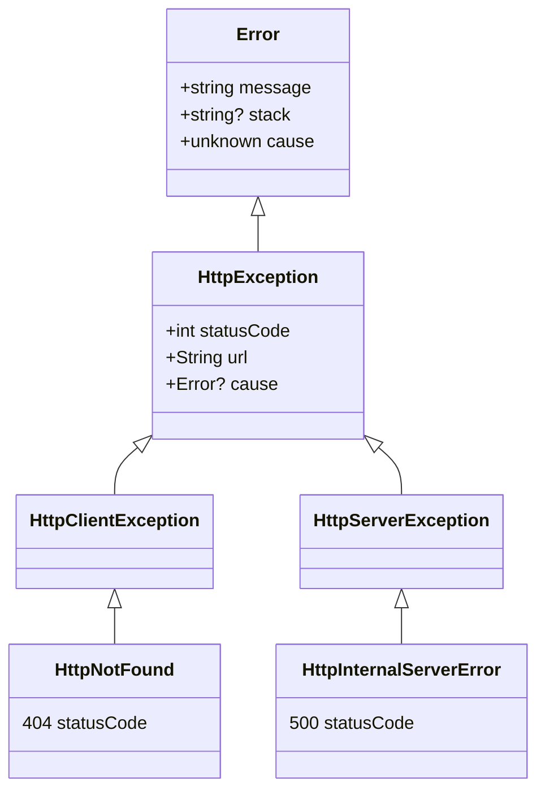

# @httpx/exception

HTTP status errors with default message, instanceof, stack and nested error support.
Lightweight, typical usage between [500b and 1300b](#bundle-size).
Includes convenience typeguards, optional contextual info and a built-in serializer
to cover cross-environments challenges (RSC, SSR...).

[](https://www.npmjs.com/package/@httpx/exception)
[](https://github.com/belgattitude/httpx/blob/main/packages/exception/CHANGELOG.md)
[](https://app.codecov.io/gh/belgattitude/httpx/tree/main/packages%2Fexception)
[](https://github.com/belgattitude/httpx/blob/main/packages/exception/.size-limit.cjs)
[](#compatibility)
[](https://browserslist.dev/?q=ZGVmYXVsdHMsY2hyb21lID49IDk2LGZpcmVmb3ggPj0gOTAsZWRnZSA%2BPSA5MSxzYWZhcmkgPj0gMTUsaW9zID49IDE1LG9wZXJhID49IDc3)
[](https://bundlephobia.com/package/@httpx/exception@latest)
[](https://www.npmjs.com/package/@httpx/exception)

## Highlights

- 👉&nbsp; Usage by [explicit named imports](#by-named-imports) and/or [status code](#by-status-code).
- 👉&nbsp; If message not provided, defaults to [http error message](#default-messages)
- 👉&nbsp; Supports pre-defined [contextual](#error-context) information.
- 👉&nbsp; Built-in [serializer](#serializer) to allow cross-env uses (ssr, rsc, superjson, logs...).
- 👉&nbsp; Supports [nested error](#nested-errors) through native [Error.cause](https://belgattitude.github.io/httpx/#/?id=about-errorcause) support.
- 👉&nbsp; [Extends](#class-diagram) native Error class with [stacktrace](https://developer.mozilla.org/en-US/docs/Web/JavaScript/Reference/Global_Objects/Error/stack) support.
- 👉&nbsp; No deps. [Node, edge and modern browsers compatibility](#compatibility),

## Install

```bash
npm install @httpx/exception  # via npm
yarn add @httpx/exception     # via yarn
pnpm add @httpx/exception     # via pnpm
```

## Documentation

👉 [Official website](https://belgattitude.github.io/httpx/exception), [GitHub Readme](https://github.com/belgattitude/httpx/tree/main/packages/exception#readme) or [generated typedoc](https://github.com/belgattitude/httpx/tree/main/packages/exception/docs/api).

---

- [Usage](#usage)
  - [By named imports](#by-named-imports)
  - [By status code](#by-status-code)
- [Parameters](#parameters)
  - [Error context](#error-context)
- [Properties](#properties)
- [Nested errors](#nested-errors)
- [Static members](#static-members)
- [Instanceof checks](#instanceof-checks)
  - [Class diagram](#class-diagram)
- [Typeguards](#typeguards)
  - [Instanceof alternatives](#instanceof-alternatives)
  - [isHttpErrorStatusCode](#ishttperrorstatuscode)
- [Serializer](#serializer)
  - [JSON](#json)
  - [Serializable](#serializable)
- [Default messages](#default-messages)
  - [Non-official status codes](#non-official-status-codes)
- [Helpers](#helpers)
  - [isErrorWithErrorStatusCode](#iserrorwitherrorstatuscode)
  - [isObjectWithErrorStatusCode](#isobjectwitherrorstatuscode)
- [About bundle](#about-bundle)
  - [Compatibility](#compatibility)
  - [Bundle size](#bundle-size)
  - [Packaging](#packaging)
  - [Typescript](#typescript)
- [Upgrade](#upgrade)
- [Support](#support)

---

## Usage

### By named imports

Explicit named imports are prefixed by `Http` to ease
IDE experience. Message is optional and default to the [default message](#default-messages). Additional
[parameters](#parameters) are supported.

```typescript
import { HttpNotFound, HttpBadRequest } from "@httpx/exception";

const e = new HttpNotFound();
// 👉 e.message     -> 'Not found' (default message)
// 👉 e.statusCode  -> 404
// 👉 -> e instanceof HttpNotFound (and HttpClientException, HttpException and Error)

const e400 = new HttpBadRequest("Problems parsing JSON");
// 👉 e.message     -> 'Problems parsing JSON'
// ...
```

### By status code

The `createHttpException` function allows to create an exception from an
arbitrary status code.

```typescript
import { createHttpException } from "@httpx/exception";

const e404 = createHttpException(404); // e404 instanceof HttpClientException
const e500 = createHttpException(500); // e500 instanceof HttpServerException
```

Additional [parameters](#httpexception-parameters) can be provided as a second argument.

```typescript
import { createHttpException, HttpNotImplemented } from "@httpx/exception";

throw createHttpException(404, "The graal is yet to find !");

const e500 = createHttpException(500, {
  message: "Something really wrong happened.",
  url: "https://api.dev/gateway",
  cause: new HttpNotImplemented(), // or any Error...
});
```

## Parameters

Http exceptions and `createHttpException` accept a parameter of type `string | HttpExceptionParams`. If no parameter
is provided the [default message](#default-messages) is used.

### Error context

It's possible to attach informational context to an exception. This is particularly useful when used with
centralized logging / error reporting.

| HttpExceptionParams | Type                      | Description                                                                                                                        |
| ------------------- | ------------------------- | ---------------------------------------------------------------------------------------------------------------------------------- |
| statusCode          | `number`                  | Http error status code (400-599).                                                                                                  |
| message             | `string`                  | Default or provided message.                                                                                                       |
| url                 | `string?`                 | Origin url..                                                                                                                       |
| method              | `HttpMethod?`             | Origin http method.                                                                                                                |
| code                | `string?`                 | Custom error code (not to be confused with statusCode).                                                                            |
| errorId             | `string?`                 | Unique custom error id.                                                                                                            |
| stack               | `string?`                 | @see [Error.prototype.stack](https://developer.mozilla.org/en-US/docs/Web/JavaScript/Reference/Global_Objects/Error/Stack) on MDN. |
| cause               | `Error?`                  | @see [about error cause](#about-errorcause)                                                                                        |
| issues              | `HttpValidationIssues[]?` | Only supported by HttpUnprocessableEntity (422)                                                                                    |

Example:

```typescript
import { HttpGatewayTimeout, HttpInternalServerError } from "@httpx/exception";

const e500 = new HttpInternalServerError({
  url: "https://api.dev/gateway",
  method: "GET",
  code: "ERR_UNREACHABLE_SERVICE",
  errorId: nanoid(),
  // 👉 nesting
  cause: new HttpGatewayTimeout({
    message: "This Serverless Function has timed out",
    errorId: "cdg1::h99k2-1664884491087-b41a2832f559",
  }),
});
```

## Properties

All parameters are exposed as properties.

| HttpException | Type                  | Description                                                                                                                        |
| ------------- | --------------------- | ---------------------------------------------------------------------------------------------------------------------------------- |
| statusCode    | `number`              | Http error status code (400-599).                                                                                                  |
| message       | `string`              | Default or provided message.                                                                                                       |
| url           | `string?`             | Origin url..                                                                                                                       |
| method        | `HttpMethod?`         | Origin http method.                                                                                                                |
| code          | `string?`             | Custom error code (not to be confused with statusCode).                                                                            |
| errorId       | `string?`             | Unique custom error id.                                                                                                            |
| stack         | `string?`             | @see [Error.prototype.stack](https://developer.mozilla.org/en-US/docs/Web/JavaScript/Reference/Global_Objects/Error/Stack) on MDN. |
| cause         | `Error?`              | @see [about nested errors](#nested-errors)                                                                                         |
| issues        | `ValidationIssues[]?` | Only supported by HttpUnprocessableEntity (422)                                                                                    |

```typescript
import { HttpUnprocessableEntity } from "@httpx/exception";

const e422 = new HttpUnprocessableEntity({
  message: "Request validation failed",
  url: "https://acme.org/api/user/create",
  method: "POST",
  issues: [
    // typed as ValidationIssues[]
    {
      message: "Invalid address",
      path: ["addresses", 0, "line1"],
      code: "empty_string",
    },
  ],
});

// 👉 e422.issues
// 👉 e422.method === 'POST'
// ...
```

## Nested errors

When creating a http exception, it's possible to attach the original error
to the native [Error.cause](https://developer.mozilla.org/en-US/docs/Web/JavaScript/Reference/Global_Objects/Error/cause)
property.

```typescript
const e = new HttpBadRequest({
  // 👉 nesting
  cause: new TypeError({
    message: "Param validation failed",
    // 👉 nesting: multiple levels are supported
    cause: new NoSuchUser("User id is invalid"),
  }),
});
```

> Error cause is supported by [>93% of browsers](https://caniuse.com/mdn-javascript_builtins_error_cause) as
> of 12/2023. NodeJs supports it since 16.17. Nested cause will simply be discarded if not supported (no runtime error).
> The [error-cause-polyfill](https://github.com/ehmicky/error-cause-polyfill) can be installed if not provided
> already by your framework.

## Static members

All exceptions have a static `STATUS` readonly property.

```typescript
import { createHttpException, HttpMethodNotAllowed } from "@httpx/exception";

const { statusCode } = createHttpException(405);
switch (statusCode) {
  case HttpMethodNotAllowed.STATUS:
    console.log(statusCode); // 👉 405
    break;
}
```

## Instanceof checks

Http exceptions extends the native [Error class](https://developer.mozilla.org/en-US/docs/Web/JavaScript/Reference/Global_Objects/Error)
through HttpException and either HttpServerException and HttpClientException.

```typescript
import { createHttpException } from "@httpx/exception";

const e404 = createHttpException(404);
// 👉 e instanceof Error === true
// 👉 e instanceof HttpException === true
// 👉 e instanceof HttpClientException === true
// 👉 e instanceof HttpNotFound === true
// 👉 e instanceof HttpServerException === false
```

### Class diagram



## Typeguards

### Instanceof alternatives

While the usage of `instanceof` is preferred, the `isHttpException`, `isHttpClientException` and
`isServerException` can be used in place. They will check for instance and will
also ensure that the associated `statusCode` is actually valid.

```typescript
import {
  isHttpException,
  isHttpClientException,
  isHttpServerException,
} from "@httpx/exception";

// True
isHttpException(new HttpNotFound());
isHttpClientException(new HttpNotFound());
isHttpServerException(new HttpInternalServerError());

// False
isHttpClientException(new HttpInternalServerError());
isHttpServerException(new HttpNotFound());
isHttpException(new Error());
isHttpServerException(
  new (class extends HttpServerException {
    constructor() {
      super(400); // 400 isn't a server exception
    }
  })()
);
```

### isHttpErrorStatusCode

```typescript
import { isHttpErrorStatusCode } from "@httpx/exception";

// True
isHttpErrorStatusCode(404);
// False
isHttpErrorStatusCode(200);
```

## Serializer

Exceptions can be (de-)serialized to json or other formats. Use cases varies from
ssr-frameworks (ie: nextjs [getServerSideProps](https://nextjs.org/docs/basic-features/data-fetching/get-server-side-props))
/ loggers (sentry, winston...).

Nested error causes are supported but ignored [if not supported](#about-errorcause) by
the runtime.

Additionally, you can pass any native errors (`Error`, `EvalError`, `RangeError`, `ReferenceError`,
`SyntaxError`, `TypeError`, `URIError`) as well as a custom one (the later will be transformed to the base type Error).

⚠️ **Since v3.0.0**:

For security reasons [stack traces](https://developer.mozilla.org/en-US/docs/Web/JavaScript/Reference/Global_Objects/Error/stack)
won't be serialized anymore by default as they might contain sensitive information in production. To opt-in selectively
for stack traces serialization (ie: development or logging)
`convertToSerializable`, `createFromSerializable`, `toJson` and `fromJson` functions
accepts a `SerializerParams.includeStack` param as second argument.

### JSON

```typescript
import { fromJson, toJson } from "@httpx/exception/serializer";

const e = new HttpForbidden();

const json = toJson(e); // string
const deserialized = fromJson(json);

// e === deserialized
```

> **Tip**
> See also how to integrate with [superjson](https://github.com/blitz-js/superjson#recipes)

<details>
<summary>Example for stack traces serialization.</summary>

```typescript
import { fromJson, toJson } from "@httpx/exception/serializer";

// To include stack traces (not safe in production)
const jsonWithStack = toJson(new HttpException(500), {
  includeStack: process.env.NODE_ENV === "development",
});

const eWithStrack = fromJson(json, {
  includeStack: process.env.NODE_ENV === "development",
});
```

</details>

### Serializable

Same as JSON but before json.parse/stringify. Allows to use a different encoder.

```typescript
import {
  convertToSerializable,
  createFromSerializable,
} from "@httpx/exception/serializer";

const e = new HttpForbidden({
  cause: new Error("Token was revoked"),
});

const serializableObject = convertToSerializable(e);
const deserialized = createFromSerializable(serializableObject);
// e === deserialized
```

<details>
<summary>Example for stack traces serialization.</summary>

```typescript
import {
  convertToSerializable,
  createFromSerializable,
} from "@httpx/exception/serializer";

const serializableObject = convertToSerializable(e, {
  includeStack: process.env.NODE_ENV === "development",
});
const deserialized = createFromSerializable(serializableObject, {
  includeStack: process.env.NODE_ENV === "development",
});
```

</details>

## Default messages

Messages are inferred from the Http exception class name. They are
[compatible](https://github.com/belgattitude/httpx/blob/main/packages/exception/test/specs/statuses-messages-compatibility.test.ts) with the popular [statuses](https://www.npmjs.com/package/statuses) package.

| Status | Class                           | Message            |
| ------ | ------------------------------- | ------------------ |
| 400    | HttpBadRequest                  | Bad request        |
| 401    | HttpUnauthorized                | Unauthorized       |
| 402    | HttpPaymentRequired             | Payment required   |
| 403    | HttpForbidden                   | Forbidden          |
| 404    | HttpNotFound                    | Not found          |
| 405    | HttpMethodNotAllowed            | Method not allowed |
| 406    | HttpNotAcceptable               | Not acceptable     |
| 407    | HttpProxyAuthenticationRequired | ...                |
| 408    | HttpRequestTimeout              | ...                |
| 409    | HttpConflict                    | ...                |
| 410    | HttpGone                        | ...                |
| 411    | HttpLengthRequired              | ...                |
| 412    | HttpPreConditionFailed          | ...                |
| 413    | HttpPayloadTooLarge             | ...                |
| 414    | HttpUriTooLong                  | ...                |
| 415    | HttpUnsupportedMediaType        | ...                |
| 416    | HttpRangeNotSatisfiable         | ...                |
| 417    | HttpExpectationFailed           | ...                |
| 418    | HttpImATeapot                   | ...                |
| 421    | HttpMisdirectedRequest          | ...                |
| 422    | HttpUnprocessableEntity         | ...                |
| 423    | HttpLocked                      | ...                |
| 424    | HttpFailedDependency            | ...                |
| 425    | HttpTooEarly                    | ...                |
| 426    | HttpUpgradeRequired             | ...                |
| 428    | HttpPreconditionFailed          | ...                |
| 429    | HttpTooManyRequests             | ...                |
| 431    | HttpRequestHeaderFieldsTooLarge | ...                |
| 451    | HttpUnavailableForLegalReasons  | ...                |

Server http status error code

| Status | Class                             | Message               |
| ------ | --------------------------------- | --------------------- |
| 500    | HttpInternalServerError           | Internal server error |
| 501    | HttpNotImplemented                | ...                   |
| 502    | HttpBadGateway                    | ...                   |
| 503    | HttpServiceUnavailable            | ...                   |
| 504    | HttpGatewayTimeout                | ...                   |
| 505    | HttpVersionNotSupported           | ...                   |
| 506    | HttpVariantAlsoNegotiates         | ...                   |
| 507    | HttpInsufficientStorage           | ...                   |
| 508    | HttpLoopDetected                  | ...                   |
| 510    | HttpNotExtended                   | ...                   |
| 511    | HttpNetwordAuthenticationRequired | ...                   |

### Non-official status codes

While their usage is not recommended, some status codes might be found in the wild (generally server status codes).

```typescript
import { createHttpException, HttpServerException } from "@httpx/exception";

const nonOfficialStatusCodes = [
  [509, "Might refer to bandwidth limit"],
  [525, "Might refer to SSL Handshake Failed (ie: cloudflare)"],
  [526, "Might refer to Invalid SSL Certificate (ie: cloudflare)"],
  ["...", "..."],
];

const e = createHttpException(509, {
  message: "Bandwidth limit exceeded",
  // ... others properties
});

// e instanceof HttpServerException

// alternatively
const alternate = new HttpServerException({
  statusCode: 509,
  message: "Bandwidth limit exceeded",
  // ... others properties
});
```

## Helpers

### isErrorWithErrorStatusCode

This typeguard is based on a convention and might help to convert a native error to a specific HttpException.

```typescript
import {
  isErrorWithErrorStatusCode,
  createHttpException,
  type isErrorWithErrorStatusCode,
} from "@httpx/exception";

try {
  throw new (class extends Error {
    statusCode = 400; // <- by convention
  })();
} catch (e) {
  // will check if the value is an Error and that there's a statusCode is >=400 && <600
  if (isErrorWithErrorStatusCode(e)) {
    throw createHttpException(e.statusCode, e.message);
  }
}
```

### isObjectWithErrorStatusCode

This typeguard is based on a convention and might help to convert an object to a specific HttpException.

```typescript
import {
  isObjectWithErrorStatusCode,
  createHttpException,
  type ObjectWithErrorStatusCode,
} from "@httpx/exception";

const noSuchUser = {
  statusCode: 404,
} satisfies ObjectWithErrorStatusCode;

class NoSuchItem extends DomainError implements ObjectWithErrorStatusCode {
  statusCode = 404;
}

if (isObjectWithErrorStatusCode(noSuchUser)) {
  throw createHttpException(e.statusCode, "Nothing");
}
```

## About bundle

### Compatibility

| Level      | CI  | Description                                                                                                                                                                                                                                                                                                                            |
| ---------- | --- | -------------------------------------------------------------------------------------------------------------------------------------------------------------------------------------------------------------------------------------------------------------------------------------------------------------------------------------- |
| Node       | ✅  | CI for 18.x, 20.x & 21.x.                                                                                                                                                                                                                                                                                                              |
| Browsers   | ✅  | [> 93%](https://browserslist.dev/?q=ZGVmYXVsdHMsIGNocm9tZSA%2BPSA5NixmaXJlZm94ID49IDkwLGVkZ2UgPj0gMTksc2FmYXJpID49IDEyLGlvcyA%2BPSAxMixvcGVyYSA%2BPSA3Nw%3D%3D) on 12/2023. [Chrome 96+, Firefox 90+, Edge 19+, ios 15+, Safari 15+ and Opera 77+](https://github.com/belgattitude/httpx/blob/main/packages/exception/.browserslistrc) |
| Edge       | ✅  | Ensured on CI with [@vercel/edge-runtime](https://github.com/vercel/edge-runtime).                                                                                                                                                                                                                                                     |
| Typescript | ✅  | TS 4.7+ / [are-the-type-wrong](https://github.com/arethetypeswrong/arethetypeswrong.github.io) checks on CI.                                                                                                                                                                                                                           |
| ES2022     | ✅  | Dist files checked with [es-check](https://github.com/yowainwright/es-check)                                                                                                                                                                                                                                                           |

> For _older_ browsers:
>
> - 👉 Most frontend frameworks can transpile the library (ie: [nextjs](https://nextjs.org/docs/app/api-reference/next-config-js/transpilePackages)...)
> - 👉 You might want to add the [error-cause-polyfill](https://github.com/ehmicky/error-cause-polyfill) to support
>   nested errors (if not present they are simply discarded - no runtime errors).

### Bundle size

Code and bundler have been tuned to target a minimal compressed footprint
for the browser. In ESM, typical usage the bundle size will vary between 500b to 1300b compressed
(including default messages for the 43 status codes).

ESM individual imports are tracked by a
[size-limit configuration](https://github.com/belgattitude/httpx/blob/main/packages/dsn-parser/.size-limit.cjs).

| Scenario                                           | Size (compressed) |
| -------------------------------------------------- | ----------------: |
| Import generic exception (`HttpClientException`)   |            ~ 390b |
| Import 1 client exception                          |            ~ 425b |
| Import 2 client exceptions                         |            ~ 447b |
| Import 6 client exceptions                         |            ~ 515b |
| Import `createHttpException` (all 43 exceptions)   |           ~ 1240b |
| Import `fromJson` (incl all + createHttpException) |           ~ 1740b |
| All serializer functions + exceptions + typeguards |           ~ 1950b |

> For CJS usage (not recommended) track the size on [bundlephobia](https://bundlephobia.com/package/@httpx/exception@latest).

### Packaging

This library offers a dual cjs/esm bundle. The (optional) serializer code has been tuned to
avoid issues with [dual package hazards](https://nodejs.org/api/packages.html#dual-package-hazard).

The export fields and the builds are checked on the CI with [are-the-types-wrong](https://arethetypeswrong.github.io/).

> PS: Plans to remove cjs support might land in a next major version.

### Typescript

This library targets typescript 5+ with descriptions (see
[the generated api docs](https://github.com/belgattitude/httpx/tree/main/packages/exception/docs/api)).

## Upgrade

> Refer to the [UPGRADE.md](https://github.com/belgattitude/httpx/blob/main/packages/exception/UPGRADE.md) for detailed information.

| Version | Comment                                                             |
| ------- | ------------------------------------------------------------------- |
| 3.x     | Serializer functions don't include stack by default                 |
| 2.x     | Node 18.x, modern browsers (see how to [transpile](#compatibility)) |

## Support

Open [an issue on github](https://github.com/belgattitude/httpx/issues).

## Contributors

Contributions are warmly appreciated. Have a look to the [CONTRIBUTING](https://github.com/belgattitude/httpx/blob/main/CONTRIBUTING.md) document.

## Sponsors

If my OSS work brightens your day, let's take it to new heights together!
[Sponsor](<[sponsorship](https://github.com/sponsors/belgattitude)>), [coffee](<(https://ko-fi.com/belgattitude)>),
or star – any gesture of support fuels my passion to improve. Thanks for being awesome! 🙏❤️

### Special thanks to

<table>
  <tr>
    <td>
      <a href="https://www.jetbrains.com/?ref=belgattitude" target="_blank">
         
      </a>
    </td>
    <td>
      <a href="https://www.embie.be/?ref=belgattitude" target="_blank">
            
      </a>
    </td>
  </tr>
  <tr>
    <td align="center">
      <a href="https://www.jetbrains.com/?ref=belgattitude" target="_blank">JetBrains</a>
    </td>
    <td align="center">
      <a href="https://www.embie.be/?ref=belgattitude" target="_blank">Embie.be</a>
    </td>
   </tr>
</table>

## License

MIT © [belgattitude](https://github.com/belgattitude) and contributors.
